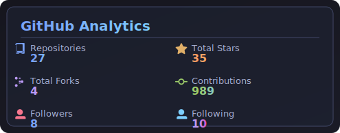
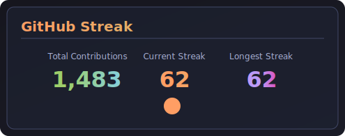
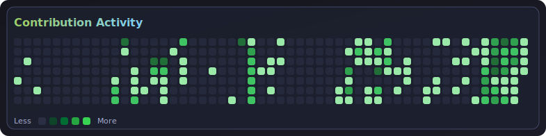

# 👋 Asante Yeboah

<h3 align="center">
AI Systems Architect • Scalable Platform Engineer • Founder @ Spidroid
</h3>

  

---

## 📊 GitHub Analytics

  
  

  

---

## 🏆 Achievements

  

---

## 🧠 Core Stack

### Languages

### Frameworks & Tools

---

## 📈 Contribution Activity

  

---

## 📫 Connect

📧 israelasanteyeboah@gmail.com  
🌐 https://spidroid.com
